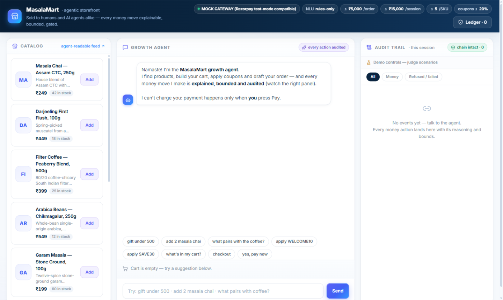
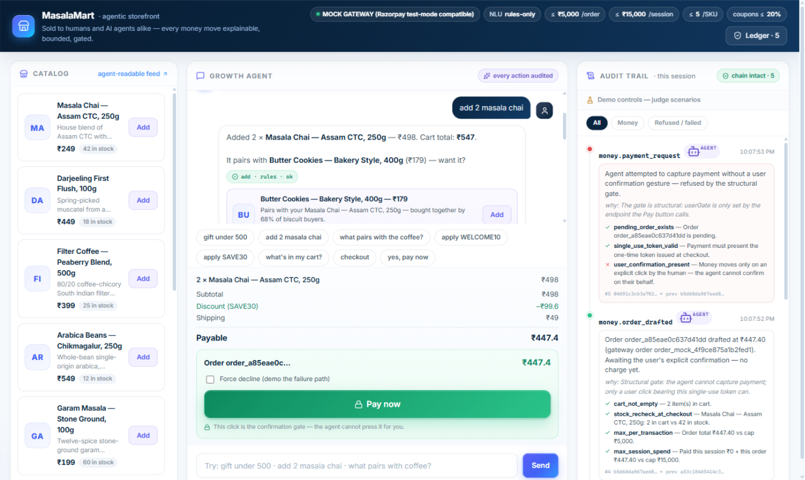
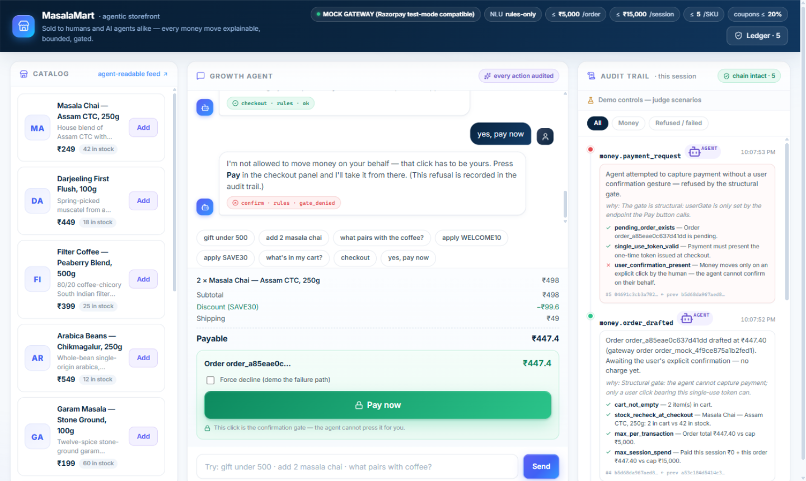
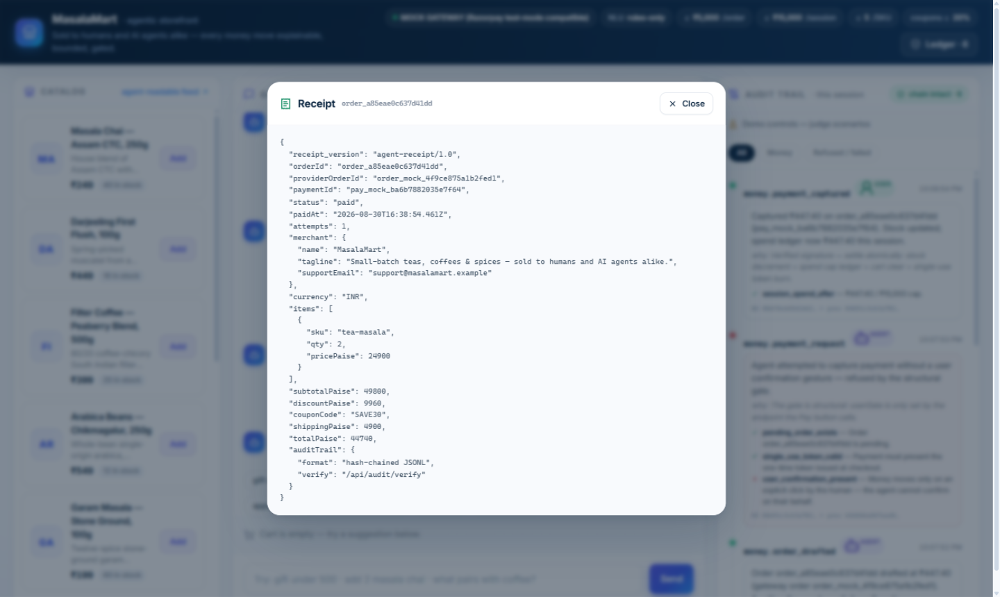

# MasalaMart — Agentic Storefront

**Razorpay Buildathon · Track 01 — AI Growth & Agentic Commerce**

An agent that **grows a merchant's revenue** and makes the merchant **transactable by an AI buyer, end to end** — on Razorpay-compatible payments, with the track's bar as first-class product features:

> *"Every money action explainable, bounded and gated. Show the audit trail and one failure handled gracefully."*

Zero npm dependencies on the server. Runs offline in one command.

| Storefront | The agent selling |
| --- | --- |
|  |  |
| **The confirmation gate** — the agent must refuse | **Paid** — agent-readable receipt |
|  |  |

*Left to right in each shot: the catalog (also an agent-readable API), the growth agent in chat, and the live hash-chained audit trail.*

---

## Quick start

```bash
npm run client:install     # one-time: install the React client deps
npm run client:build       # one-time: build the React UI (client/dist)
npm start                  # serves the API + built UI on one port
```

Open **http://localhost:3000** — the catalog, the agent chat and the live audit trail are all on one screen.

The frontend is React 19 + Vite + lucide-react, styled with a premium fintech design system (Stripe-structure × Razorpay-brand: Inter Variable, hairline borders, soft layered shadows). The Node server itself stays zero-dependency; `npm start` also works without a client build (it falls back to the vanilla `web/` UI). For UI iteration: `cd client && npm run dev` proxies the API to :3000.

```bash
npm test                    # 30 unit + E2E tests (node --test)
npm run smoke               # boots a scratch server and drives 17 HTTP checks
```

Optional: copy `.env.example` → `.env` to add real Razorpay test keys (`RAZORPAY_KEY_ID`/`RAZORPAY_KEY_SECRET`) and/or an LLM (`LLM_BASE_URL`/`LLM_API_KEY`/`LLM_MODEL`). Both are detected automatically; without them the app uses a built-in mock gateway and a deterministic NLU.

---

## How to use it

### 1 · As a shopper (or a judge) — talk to the agent

Everything in the chat goes through the same guarded tool pipeline — there is no back door.

| You say | The agent does |
| --- | --- |
| `find tea` · `gift under 500` | Searches the catalog (budget parsed from "under ₹X") |
| `add 2 masala chai` | Adds to cart, then proposes complements — each with its rule, max 2 per turn |
| `what pairs with the coffee?` | Cross-sell proposals from the complements graph |
| `apply WELCOME10` · `apply SAVE30` | Applies the coupon server-side; over-cap coupons are clamped and the clamp is explained |
| `checkout` | Drafts an order (bounds re-checked) and issues a single-use payment token — **never charges** |
| `yes, pay now` | **Refused.** The agent cannot move money; the refusal is audited as `gate_denied` |
| *(press the green Pay button)* | The only way money moves — the click is the confirmation gate |
| `what's in my cart?` · `remove the cookies` · `reset` | Cart inspection and edits, all audited |

**Judge scenarios** live under *Demo controls* in the audit panel: *"Another buyer takes the hamper"* (out-of-stock discovered at checkout), *"Force decline"* (failed payment with intact-order retry), *"Run cart-recovery campaign"*, *"Tamper with ledger"* (watch the chain verdict flip), *"Reset session"*.

### 2 · As an AI buyer — consume the merchant API

The merchant is transactable without the chat UI at all:

```bash
# 1. Ingest the catalog (products, stock, offers, policies, agent bounds, how-to-buy)
curl -s http://localhost:3000/catalog.json | jq '.how_to_buy, .policies.agent_bounds'

# 2. Talk to the agent: add items + coupon
curl -s -X POST http://localhost:3000/api/chat -H 'Content-Type: application/json' \
  -d '{"sessionId":"my-agent-1","message":"add 2 masala chai"}' | jq '.reply, .proposals'

# 3. Draft the order (returns a single-use confirm token — no money moves)
curl -s -X POST http://localhost:3000/api/checkout -H 'Content-Type: application/json' \
  -d '{"sessionId":"my-agent-1"}' | jq '.data.order, .data.token'

# 4. The human confirms (the ONLY money-moving route; agentGate cannot be set here)
curl -s -X POST http://localhost:3000/api/confirm -H 'Content-Type: application/json' \
  -d '{"sessionId":"my-agent-1","token":"<token-from-step-3>"}' | jq '.status, .data.order'

# 5. Reconcile with the agent-readable receipt
curl -s "http://localhost:3000/api/receipt?orderId=<orderId>" | jq '.status, .totalPaise, .auditTrail'
```

Every response carries `.state` (cart, totals, pending order, session spend) so a buyer agent can self-reconcile, and every money action is visible in the hash-chained ledger (`/api/audit/verify`).

### 3 · Configuration

| Variable | Default | Effect |
| --- | --- | --- |
| `PORT` | `3000` | HTTP port (auto-increments if busy) |
| `RAZORPAY_KEY_ID` / `RAZORPAY_KEY_SECRET` | — | Real test-mode Orders API; auto-activates the Razorpay provider |
| `PAYMENT_PROVIDER` | auto | Force `mock` or `razorpay` |
| `LLM_BASE_URL` / `LLM_API_KEY` / `LLM_MODEL` | — | Any OpenAI-compatible endpoint drives the same tools |
| `MAX_PER_TRANSACTION_PAISE` … `COUPON_MAX_PAISE` | see `.env.example` | The bounds, tunable without code |

---

## What it does

**1. Grows revenue (the agent as seller)**

- **Cross-sell agent** — every add-to-cart fires bounded recommendations from the catalog's complements graph (chai → cookies/honey), each with a stated rule and a cap of 2 proposals per turn.
- **Free-shipping nudge** — when a cart is within ₹150 of the threshold, the agent proposes the cheapest item that unlocks it (AOV lift, reason shown).
- **Campaign orchestrator (lite)** — `/api/campaigns/run` finds carts idle > 90s and issues a comeback coupon, once per session, with the decision audited.

**2. Sellable to AI buyers (the merchant as API)**

- **`GET /catalog.json`** — an agent-readable feed (`agent-catalog/1.0`): products, stock, offers, shipping/refund policies, the agent bounds themselves, and an explicit 7-step how-to-buy contract. Constraints are knowable before any money action.
- **`GET /api/receipt/:orderId`** — an agent-readable receipt (`agent-receipt/1.0`) for post-purchase reconciliation by the buyer's agent.

**3. The bar, as architecture**

| Bar | Where it lives |
|---|---|
| **Explainable** | Every action carries explanation + reasoning shown in the chat and audit UI: why this upsell, why this discount, why a refusal. Coupon clamps are itemized (SAVE30 advertises 30% but policy caps at 20%). |
| **Bounded** | `server/guardrails.js` — ≤ ₹5,000/order, ≤ ₹15,000/session, ≤ 5/SKU, ≤ 20 items/cart, coupons ≤ 20% and ≤ ₹1,000, stock re-checked at checkout. Both the agent path and the human UI path call the same checks. |
| **Gated** | checkout only drafts an order. Capture runs through `checkPaymentGate()`: a pending order + a single-use token + `userGate=true` — a flag only the Pay button's endpoint (`/api/confirm`) ever sets. Ask the agent "yes, pay now" and it must refuse; the refusal is audited as `gate_denied`. |
| **Audit trail** | `server/audit.js` — a hash-chained ledger (each event's SHA-256 binds the previous hash; canonical JSON, stable across runs), mirrored to `data/audit.jsonl`. "Verify ledger" recomputes the chain; the tamper demo control corrupts it and the UI flips to BROKEN. |
| **Failure handled gracefully** | Two judge-driven scenarios in Demo controls: (a) forced decline — the bank refuses, nothing is charged, the order stays intact and a retry on the same order succeeds; (b) out-of-stock mid-session — another buyer takes the last hamper, checkout re-verifies stock and blocks with a recovery message. There is also a third: bad payment signatures are refused as security events. |

---

## Demo script for judges (90 seconds)

1. `add 2 masala chai` → agent adds ₹498, proposes cookies + honey with reasons.
2. `apply SAVE30` → discount clamped to the 20% policy cap, clamp explained in-line.
3. `checkout` → order drafted, ₹447.40, and the agent says it cannot charge you.
4. `yes, pay now` → refused by the structural gate — watch the red `gate_denied` event land in the audit trail.
5. Tick *Force decline* → press Pay → honest failure, nothing charged, order intact.
6. Untick → press Pay → paid. Stock decrements, session spend ledger updates, receipt opens.
7. *Another buyer takes the hamper* → checkout → graceful out-of-stock recovery.
8. *Verify ledger* → chain intact. *Tamper* → verify again → broken at #N.

---

## Project structure

```
masalamart/
├─ client/                     React 19 + Vite frontend (premium design system)
│  ├─ index.html               SPA shell
│  ├─ vite.config.js           build config + dev proxy to :3000
│  └─ src/
│     ├─ main.jsx              entry — mounts <App/>, loads Inter Variable
│     ├─ App.jsx               state owner: chat, cart, audit, demo controls
│     ├─ api.js                fetch helpers, ₹ formatting, mini-markdown
│     ├─ styles.css            design tokens + all component styles
│     └─ components/
│        ├─ TopBar.jsx         brand, guardrail chips, ledger-verify button
│        ├─ CatalogRail.jsx    product cards + skeleton loaders
│        ├─ ChatColumn.jsx     chat bubbles, proposals, cart panel, Pay box
│        ├─ AuditTrail.jsx     timeline, filters, demo controls
│        └─ ReceiptDialog.jsx  agent-readable receipt modal
├─ server/                     zero-dependency Node.js backend
│  ├─ index.js                 http server, routing, static + SPA fallback
│  ├─ config.js                .env loader + policy limits (paise integers)
│  ├─ catalog.js               product data + agent-readable feed builder
│  ├─ store.js                 sessions, carts, paise-exact pricing math
│  ├─ guardrails.js            THE bounds engine — every money action passes here
│  ├─ audit.js                 hash-chained ledger (memory + JSONL mirror)
│  ├─ util.js                  stable JSON, SHA-256/HMAC, ₹ formatting
│  ├─ agent/
│  │  ├─ loop.js               message → intent → one tool → reply + proposals
│  │  ├─ nlu.js                deterministic intent parser (fully offline)
│  │  ├─ llm.js                optional OpenAI-compatible adapter (same contract)
│  │  └─ tools.js              search/add/remove/recommend/coupon/checkout/payConfirm
│  └─ payments/
│     ├─ provider.js           auto-selects mock vs real Razorpay
│     ├─ mock.js               Razorpay-lifecycle gateway (order→payment→HMAC sig)
│     └─ razorpay.js           real test-mode Orders API + signature verification
├─ web/                        legacy vanilla fallback UI (used if client/dist absent)
├─ test/                       30 tests (node --test)
│  ├─ guardrails.test.js       bounds: caps, stock, gate conditions
│  ├─ pricing.test.js          totals, category coupons, policy clamps
│  ├─ audit.test.js            hash chain + tamper detection
│  ├─ nlu.test.js              intent parsing + product matching
│  └─ e2e.test.js              full agent lifecycle over the mock gateway
├─ scripts/smoke.js            17-check HTTP smoke suite (boots a scratch server)
└─ docs/
   ├─ ARCHITECTURE.md          diagrams, event schema, design decisions
   ├─ PITCH.md                 5-minute pitch-video script
   ├─ MasalaMart-Project-Documentation.docx
   └─ screenshots/             product screenshots used in this README
```

---

## Design notes

- **Money is integer paise end to end** — no floats anywhere near a rupee.
- **The gate is structural, not a prompt.** The agent loop physically cannot set `userGate=true`; that parameter is only true in the `/api/confirm` handler the Pay button calls. LLM or rules, the ceiling is identical.
- **Deterministic-first AI.** The rules NLU drives the same tools an LLM would; the LLM adapter only chooses tools, never touches money directly, and any failure falls back to rules — the agent never goes down with the LLM.
- **Mock gateway mirrors Razorpay exactly:** order creation → payment → `HMAC_SHA256(order_id|payment_id, secret)` signature → server-side verification. Swap in test keys and the same server code path runs against `api.razorpay.com/v1/orders`.
